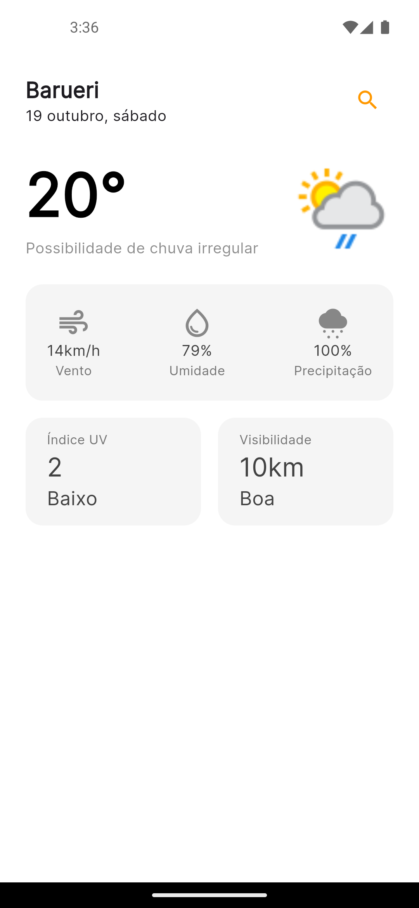

# 🌦️ Climago

**Climago** é um aplicativo Flutter simples e intuitivo que permite aos usuários pesquisar informações meteorológicas de qualquer cidade. A aplicação exibe informações como temperatura, condição do tempo, velocidade do vento, umidade, precipitação, visibilidade e índice UV. O app foi projetado para ser minimalista, limpo e fácil de usar, permitindo ao usuário navegar entre diferentes cidades com apenas alguns toques.

## 📱 Capturas de Tela



## 🚀 Funcionalidades

- **Pesquisa de cidades**: O usuário pode procurar por qualquer cidade ao redor do mundo e visualizar as informações meteorológicas mais recentes.
- **Dados meteorológicos detalhados**: Exibe temperatura atual, condição do tempo, vento, umidade, precipitação, visibilidade e índice UV.
- **Interface de usuário limpa e moderna**: Focada na simplicidade e clareza das informações, com elementos visuais que facilitam a leitura.
- **Suporte para ícones climáticos**: Exibição de ícones gráficos que representam a condição do tempo (chuva, sol, nublado, etc.).
- **Atualização em tempo real**: As informações meteorológicas são buscadas diretamente de uma API de clima confiável.

## 🛠️ Tecnologias Utilizadas

- **Flutter**: Framework para construção de interfaces nativas para iOS e Android.
- **WeatherAPI**: API usada para buscar dados meteorológicos.
- **http**: Biblioteca para realizar requisições HTTP.
- **intl**: Pacote usado para formatação de datas e números.
- **flutter_launcher_icons**: Gerenciamento e configuração dos ícones do aplicativo.
- **Google Fonts**: Para a utilização de fontes customizadas.
- **flutter_dotenv**: Usado para armazenar e carregar variáveis de ambiente, como a API Key.

## 📋 Instalação

Para rodar o projeto localmente, siga as instruções abaixo:

### Pré-requisitos

- **Flutter SDK** instalado na máquina ([Instruções de instalação do Flutter](https://flutter.dev/docs/get-started/install))
- Emulador Android ou dispositivo físico para rodar o app
- API Key da **[WeatherAPI](https://www.weatherapi.com/)**

### Passo a passo

1. Clone este repositório:
   ```bash
   git clone https://github.com/seu-usuario/climago.git
   ```
2. Navegue até o diretório do projeto:
   ```bash
   cd climago
   ```
3. Instale as dependências:
   ```bash
   flutter pub get
   ```
4. Crie um arquivo **.env** na raiz do projeto com o conteúdo a seguir:
   ```
   WEATHER_API_KEY=SuaChaveAPI
   ```
5. Rode o aplicativo:
   ```bash
   flutter run
   ```

## 📚 Estrutura do Projeto

O projeto está organizado da seguinte forma:

```
lib/
│
├── screens/
│   └── home.dart             # Tela principal onde os dados do tempo são exibidos
├── services/
│   └── weather_service.dart   # Serviço responsável por fazer requisições à API de clima
├── main.dart                 # Arquivo principal que inicia o app
assets/
└── icons/                    # Ícones usados no projeto
    └── app_icon.png          # Ícone principal do aplicativo
```

### Descrição dos arquivos principais

- **`main.dart`**: Contém a configuração inicial do aplicativo e carrega o arquivo `.env` com as variáveis de ambiente.
- **`home.dart`**: Tela onde as informações meteorológicas são exibidas.
- **`weather_service.dart`**: Serviço que faz a chamada HTTP para a API de clima.
- **`assets/icons/app_icon.png`**: Ícone usado para o app.
- **`assets/images/print.png`**: Imagem de exemplo do aplicativo.

## ⚙️ Configuração de Ícones

Este projeto usa o pacote **flutter_launcher_icons** para gerenciar os ícones do app. Para alterar ou adicionar novos ícones:

1. Coloque o ícone na pasta `assets/icons/`.
2. Atualize o campo `image_path` no arquivo **`pubspec.yaml`**.
3. Gere os ícones com o comando:
   ```bash
   flutter pub run flutter_launcher_icons:main
   ```

## 🌐 APIs Utilizadas

**WeatherAPI** é a principal fonte de dados meteorológicos do app. Para obter uma chave de API, siga os passos:

1. Acesse [WeatherAPI](https://www.weatherapi.com/).
2. Crie uma conta e obtenha sua chave de API.
3. Insira sua chave no arquivo **.env**, conforme indicado na seção de instalação.

## 📦 Dependências

As dependências principais deste projeto são:

```yaml
dependencies:
  flutter:
    sdk: flutter
  cupertino_icons: ^1.0.8
  google_fonts: ^4.0.3
  http: ^0.13.5
  intl: ^0.18.0
  flutter_launcher_icons: ^0.14.1
  flutter_dotenv: ^5.0.2
```

## 🛡️ Licença

Este projeto é licenciado sob a licença MIT. Veja o arquivo [LICENSE](LICENSE) para mais detalhes.
